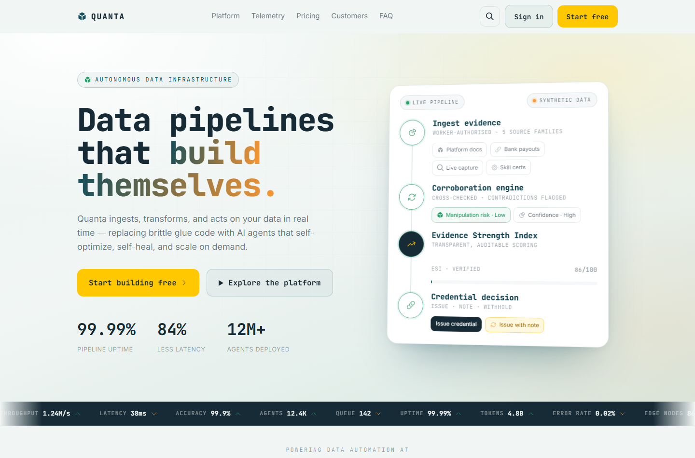
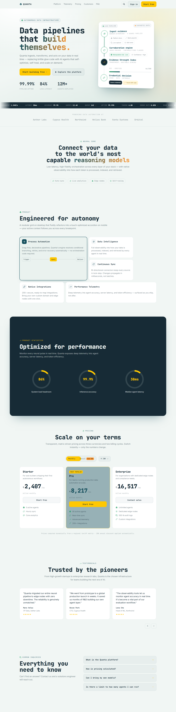
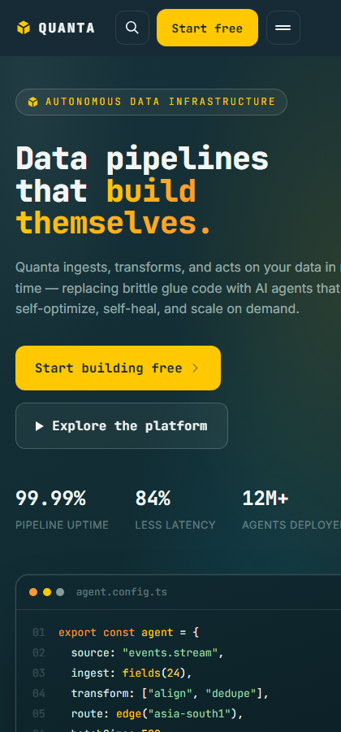

<div align="center">

# ⚡ QUANTA — Next-Gen AI Data Automation Platform

### *Data pipelines that build themselves.*

A premium, high-converting, fully-responsive landing page for an AI-driven data automation platform — engineered **from scratch** with semantic HTML, custom CSS, and vanilla JavaScript. **Zero UI / animation libraries.**

<br/>

[](https://quanta-ai.web.app)
&nbsp;
[](https://github.com/Hardik182005/nextgen-ai-platform)

<br/>


<br/>



</div>

---

## ✨ Why vanilla?

The two core features have hard architectural constraints — **strict state isolation, zero external dependencies, native-only motion.** Plain HTML / CSS / JS gives full control over the render path, so we can *guarantee* no global re-renders and no banned libraries, while keeping Time-to-Interactive razor-thin.

---

## 🧩 Core Features

### 1️⃣ Matrix-Driven Pricing & Performance-Isolated Currency Switcher
- Prices are **computed, never hardcoded**, from a multi-dimensional matrix:
  `tier (base rate) × currency (regional tariff) × billing cycle`.
- Flat **20% annual discount** multiplier.
- **3 currencies** — INR ₹ · USD $ · EUR € — and **Monthly / Annual** cycles.
- Switching currency or cycle mutates **only the targeted price text nodes** (`textContent`) — no parent re-render, no `innerHTML` rebuild, no surrounding layout reflow.
- 👉 [`assets/js/pricing.js`](assets/js/pricing.js)

### 2️⃣ Bento-to-Accordion Wrapper with State Persistence
- Desktop renders a modern **bento grid**; mobile refactors the **same DOM nodes** into a touch-optimized **accordion**.
- A single source of truth (`activeIndex`) carries the `.is-active` class, so the **context locks across the breakpoint** — hover/lock a node on desktop, resize past the mobile breakpoint, and the matching accordion panel opens smoothly.
- Breakpoint crossing detected via `matchMedia` (one event per crossing → zero resize thrashing). Transitions are native CSS `grid-template-rows`.
- 👉 [`assets/js/bento.js`](assets/js/bento.js)

### ➕ Signature extras
- **Interactive 3D live pipeline** (hero) — built from scratch with CSS 3D transforms: cursor parallax tilt, a scanner that sweeps the connector, and a **live, state-isolated ESI score** that updates only its own text node.
- **Live signals ticker**, **scroll-progress bar**, and **3D scroll-reveals** down the page.

---

## 🏆 Scoring Matrix → Implementation

| # | Criterion | How it's met |
|---|-----------|--------------|
| 1 | Feature 1 (15) — dynamic matrix pricing | Computed from a multi-dimensional config object, no hardcoded UI values |
| 2 | State Isolation (15) | `textContent`-only updates; no global re-render or reflow |
| 3 | Feature 2 (10) — zero-dependency | Bento↔accordion, context-lock on resize, no banned libs |
| 4 | Semantic DOM (15) | `header / main / nav / section / article / figure / ol` |
| 5 | SEO & Metadata (10) | Meta + Open Graph + Twitter + JSON-LD, robots, sitemap |
| 6 | Loading Performance (5) | Loader + entry orchestration **≤ 500ms**, never blocks TTI |
| 7 | Asset Compliance (15) | All **14 SVGs**, **both fonts**, **all 6 palette colors**, `demo.mp4` |
| 8 | Breakpoint Fluidity (10) | Clean mobile / tablet / desktop, no clipping |
| 9 | Motion Accuracy (5) | 180ms ease-out micro · 360ms ease-in-out reflow |

---

## 🎨 Provided Assets — fully integrated

| Asset | Usage |
|-------|-------|
| **Fonts** | JetBrains Mono (display/code) + Inter (body) — self-hosted `woff2`, 8 weights |
| **Palette (MP025)** | Arctic Powder `#F1F6F4` · Forsythia `#FFC801` · Nocturnal Expedition `#114C5A` · Mystic Mint `#D9E8E2` · Deep Saffron `#FF9932` · Oceanic Noir `#172B36` |
| **SVGs** | All **14** icons, recolored via CSS masks |
| **demo.mp4** | Embedded in the in-page video modal |

> 🔒 **No external resources** — fonts, icons and video are all self-hosted.

---

## 🖼️ Preview

<div align="center">

&nbsp;&nbsp;

</div>

---

## 🛠️ Tech Stack

```
Markup      Semantic HTML5
Styling     Custom CSS (variables, grid, 3D transforms, masks)
Behaviour   Vanilla JavaScript (ES2020, IntersectionObserver, matchMedia, WAAPI)
Fonts       JetBrains Mono · Inter (self-hosted woff2)
Hosting     Firebase Hosting
Build step  none — pure static
```

---

## 🚀 Run locally

```bash
npm run dev          # serves http://localhost:5173
# or just open index.html in a browser
```

## ☁️ Deploy

Static site — deploy anywhere (Firebase / Vercel / Netlify / GitHub Pages). No build step.

```bash
firebase deploy --only hosting:quanta-ai --project mediflow-nexus-2026
```

---

## 📁 Project Structure

```
index.html
assets/
  css/styles.css            design system + components
  js/pricing.js             Feature 1 — isolated matrix pricing
  js/bento.js               Feature 2 — bento ↔ accordion + context lock
  js/main.js                loader, reveals, pipeline, parallax, UI
  fonts/                    self-hosted woff2 + fonts.css
  icons/                    14 provided SVGs
  img/                      favicon + OG image
  media/demo.mp4
robots.txt · sitemap.xml · site.webmanifest · firebase.json · vercel.json
```

---

<div align="center">

**Built for the Next-Gen AI Platform Speed Run** · Made with ⚡ and zero dependencies

</div>
